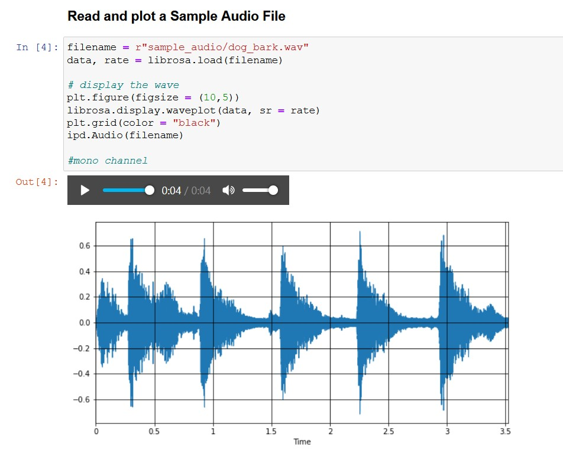

# Audio-Classification-using-Deep-Neural-Nets
### Building a High End Audio Classification System using Deep Neural Nets and Librosa
- ---------------------------------------------------------------------------------------------------------------------------------------------------------------------------------------
### Definition : 
#### What is Audio and Audio Signal ?
- Audio is a term used to describe any sound or noise in a range the human ear is capable of hearing. Measured in hertz/ Khertz
- An audio signal is a representation of sound, typically using either a changing level of electrical voltage for analog signals, or a series of binary numbers for digital signals.

#### What is DSP, and how it is useful for Audio Processing ?
- DSP : Digital Signal Processing, is the use of digital processing, such as by computers or more specialized digital signal processors, to perform a wide variety of signal processing operations.
- DSP Performs many mathematical calculation, like STFT, LTFT onto the Audio Signal to bring out the insights from it, which a normal human cannot perceive from MEL/MFCC Graphs

#### What is MEL Spectrogram ?
- MEL Spectrogram is composed of 2 words MEL and Spectrogram
- MEL : The Mel Scale, mathematically speaking, is the result of some non-linear transformation of the frequency scale. This Mel Scale is constructed such that sounds of equal distance from each other on the Mel Scale, also “sound” to humans as they are equal in distance from one another.
- Spectrogram : It is the Spectra of all those frequencies with MEL Scale 

